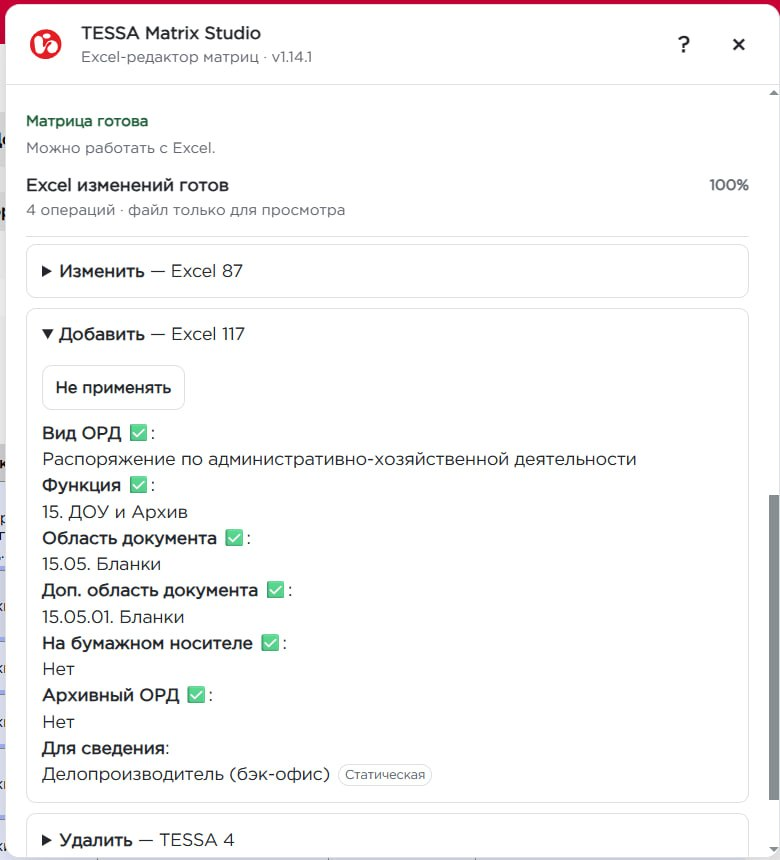
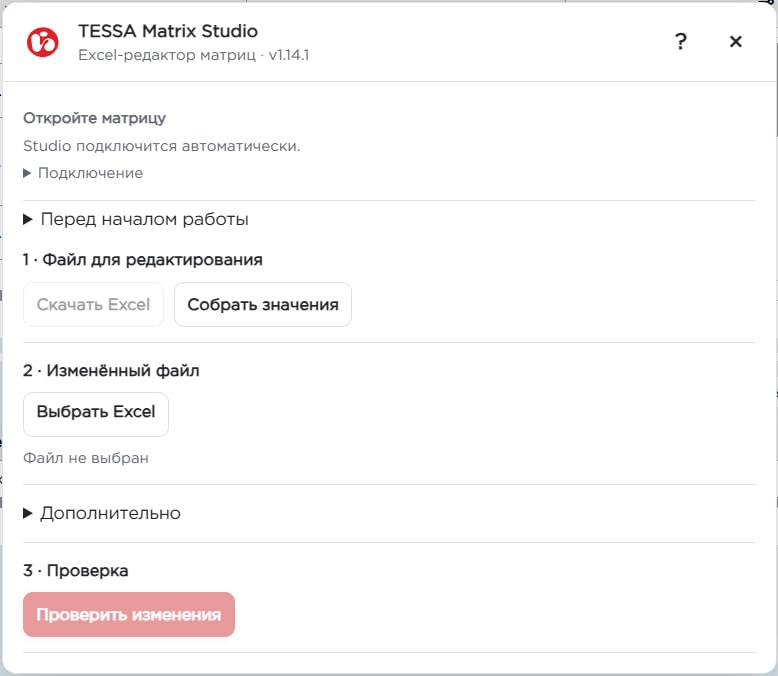
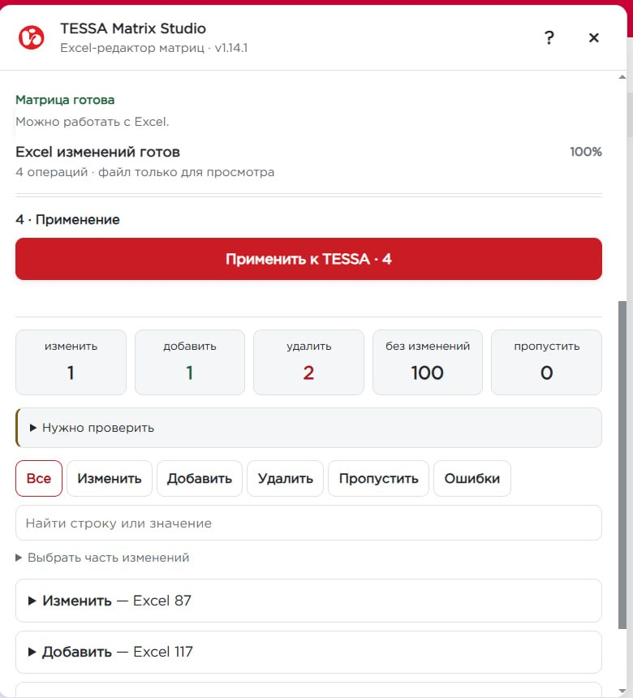

# TESSA Matrix Studio

**Безопасное массовое редактирование матриц согласования TESSA через Excel**

`TESSA → Excel → изменения → сравнение → Preview → Apply → проверка результата`

### [УСТАНОВИТЬ](https://github.com/ShapArt/tessa-matrix-studio/releases/latest/download/tessa-matrix-studio.user.js) · [ПОСЛЕДНИЙ РЕЛИЗ](https://github.com/ShapArt/tessa-matrix-studio/releases/latest) · [ПОЛНАЯ ДОКУМЕНТАЦИЯ](../README.md)

**v1.14.1 · Автор: Шаповалов Артём**

TESSA Matrix Studio добавляет в открытую карточку матрицы отдельную панель для массовых изменений через Excel. Пользователь работает с привычной таблицей, а Studio сама определяет, что нужно **изменить, добавить или удалить**, показывает точный план до записи и только после подтверждения применяет его к TESSA.

Это не «слепой импорт Excel»: перед Apply Studio повторно проверяет актуальное состояние матрицы, а после записи заново читает TESSA и подтверждает фактический результат.

## Как это работает

| 1 | 2 | 3 | 4 |
|---|---|---|---|
| **Скачать Excel** | **Внести изменения** | **Проверить Preview** | **Применить к TESSA** |
| Актуальная матрица и справочники | Массовая правка в привычном формате | Точный список ADD / UPDATE / DELETE | Только проверенный план |

  
   Studio подключается к открытой матрице и ведёт пользователя по шагам.

## 1. Работа с матрицей в Excel

Studio выгружает текущую матрицу в Excel вместе со служебными идентификаторами, необходимыми для точного сопоставления строк. Пользователь меняет только рабочие данные — массово, с обычными фильтрами и возможностями Excel.

  
   Реальная рабочая выгрузка матрицы, а не демонстрационный макет.

## 2. Preview до любой записи

После загрузки изменённого файла Studio сравнивает его с TESSA и строит план операций. В Preview видно каждую затронутую строку и значения, которые будут записаны. Отдельные операции можно исключить ещё до Apply.

  
   Пользователь заранее видит, что именно будет добавлено, изменено или удалено.

## 3. Контролируемое применение

Перед записью Studio ещё раз проверяет текущее состояние матрицы. Если строка изменилась после Preview, версия больше не совпадает или операция не может быть подтверждена безопасно, она не применяется молча.

  
   Итоговые счётчики и Apply относятся только к проверенному набору изменений.

После Apply Studio повторно читает TESSA и проверяет, что ожидаемый результат действительно появился в свежем состоянии матрицы.

## 4. Понятный отчёт «было → стало»

Отдельный Excel-отчёт показывает результат человеческим языком: **Изменена / Добавлена / Удалена / Пропущена**, строку Excel/TESSA, поле и значения **«Было» → «Стало»**. Для добавления и удаления разворачивается вся значимая строка.

  
   Отчёт можно использовать для проверки результата и разбора выполненных изменений.

## Почему это полезно

- **Меньше ручной работы:** массовые изменения выполняются в Excel вместо десятков или сотен однотипных действий в интерфейсе TESSA.
- **Изменения видны заранее:** Preview показывает точный план до записи.
- **Не угадывает:** неоднозначность, конфликт версии, чужая матрица или повреждённая служебная структура блокируются fail-closed.
- **Проверяет результат:** успешный запрос на запись и подтверждённое состояние TESSA считаются разными этапами.
- **Удобнее сопровождать:** есть Excel-отчёт, диагностика и пакет данных для разбора проблем.
- **Не привязан к одной матрице:** структура, поля, функции и справочники читаются из шаблона открытой матрицы.

## Production

Проект уже используется в реальной работе. Базовая production-сборка **v1.14.0** прошла полный live UAT непосредственно в TESSA — **33/33 проверки успешно, 0 FAIL, 0 NOT RUN**. Актуальный production-релиз — **v1.14.1**; его выпуск проходит regression-тесты, GitHub Actions, CodeQL и проверку публичного release-артефакта.

> Studio не повышает права пользователя и не обходит штатную модель доступа TESSA. Для записи нужны обычные права на корректировку соответствующей матрицы.

---

### Документация

Подробные инструкции, установка, безопасность, диагностика, архитектура и сценарии сопровождения находятся в **[полном README](../README.md)**.
