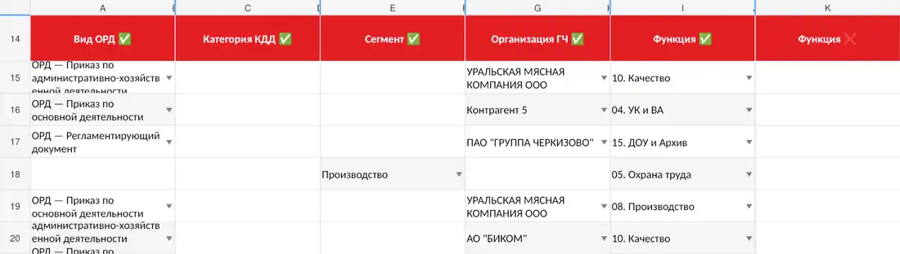
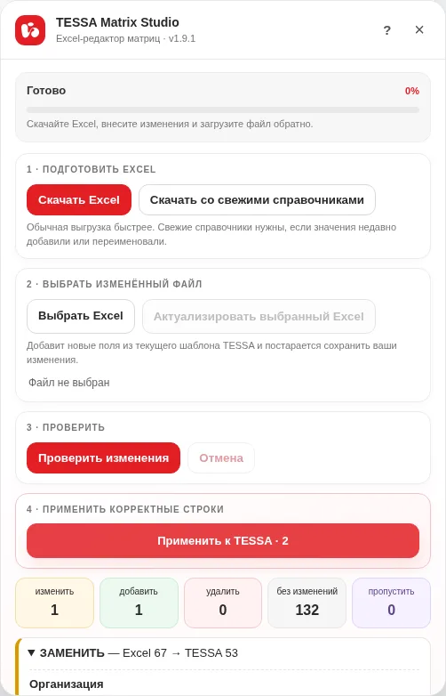

<div align="center">

# TESSA Matrix Studio

**Excel-редактор матриц согласования TESSA для Черкизово**

Выгрузка матрицы в Excel → массовая правка → проверка изменений → безопасное применение в TESSA.

[](https://github.com/ShapArt/tessa-matrix-studio/releases/latest)
[](https://github.com/ShapArt/tessa-matrix-studio/actions/workflows/quality.yml)
[](https://www.tampermonkey.net/)

### [УСТАНОВИТЬ](https://cdn.jsdelivr.net/gh/ShapArt/tessa-matrix-studio@main/tessa-matrix-studio.user.js) · [СКАЧАТЬ РЕЛИЗ](https://github.com/ShapArt/tessa-matrix-studio/releases/latest) · [ОТКРЫТЬ КОД](https://github.com/ShapArt/tessa-matrix-studio/blob/main/tessa-matrix-studio.user.js) · [СООБЩИТЬ ОБ ОШИБКЕ](https://github.com/ShapArt/tessa-matrix-studio/issues/new/choose)

**v1.9.12 · Автор: Шаповалов Артём**

</div>

> [!IMPORTANT]
> TESSA Matrix Studio **не выдаёт и не повышает права**. Для применения изменений у пользователя должны быть штатные права TESSA на корректировку соответствующей матрицы, а сама матрица должна находиться в состоянии, допускающем редактирование.

---

## Что делает скрипт

TESSA Matrix Studio добавляет в карточку матрицы отдельную панель. Работа остаётся под контролем пользователя: сначала матрица выгружается в `.xlsx`, затем Studio строит понятный diff и только после подтверждения записывает изменения в TESSA.

<div align="center">
  
  <br><sub>Реальный интерфейс TESSA Matrix Studio v1.9.3</sub>
</div>

### Четыре шага

| 1 | 2 | 3 | 4 |
|---|---|---|---|
| **Скачать Excel** | **Изменить файл** | **Проверить изменения** | **Применить к TESSA** |
| Получить текущую матрицу | Внести нужные правки | Увидеть точный план действий | Записать только проверенный план |

На этапе **«Проверить изменения» ничего в TESSA не изменяется**.

---

# Быстрый старт

Если Tampermonkey уже установлен и разрешён для userscript'ов:

1. Нажмите **[УСТАНОВИТЬ TESSA MATRIX STUDIO](https://cdn.jsdelivr.net/gh/ShapArt/tessa-matrix-studio@main/tessa-matrix-studio.user.js)**.
2. Подтвердите установку версии **1.9.12** в Tampermonkey.
3. Откройте матрицу TESSA и обновите страницу (`Ctrl+R`).
4. Убедитесь, что появилась панель **TESSA Matrix Studio**.
5. Сначала нажмите **Скачать Excel** и сохраните исходную выгрузку как резервную копию.

Если Tampermonkey ещё не установлен — используйте инструкцию ниже.

---

# Установка

Нужно один раз установить Tampermonkey, разрешить выполнение userscript'ов и затем установить TESSA Matrix Studio.

## Chrome / Edge

### 1. Установите Tampermonkey

- [Chrome Web Store — Tampermonkey](https://chromewebstore.google.com/detail/tampermonkey/dhdgffkkebhmkfjojejmpbldmpobfkfo)
- [Microsoft Edge Add-ons — Tampermonkey](https://microsoftedge.microsoft.com/addons/detail/tampermonkey/iikmkjmpaadaobahmlepeloendndfphd)

После установки откройте страницу управления расширением Tampermonkey.

<div align="center">
  
</div>

Для Tampermonkey 5.3+ в Chrome-based браузерах требуется разрешить выполнение userscript'ов. В Chrome 138+ для этого доступен отдельный переключатель **Allow User Scripts / Разрешить пользовательские скрипты**.

<div align="center">
  
</div>

Если такого переключателя нет, откройте `chrome://extensions` или `edge://extensions` и включите **Developer mode / Режим разработчика**.

<div align="center">
  
</div>

Официальная справка: [Tampermonkey — Permission to execute userscripts](https://www.tampermonkey.net/faq.php?q=Q209).

## Firefox

1. Откройте [Tampermonkey в Firefox Add-ons](https://addons.mozilla.org/firefox/addon/tampermonkey/).
2. Нажмите **Добавить в Firefox**.
3. Подтвердите разрешения расширения.
4. Проверьте, что расширение включено.

Требование `Allow User Scripts / Developer mode` из официального Q209 относится к Chrome-based браузерам и не является отдельным шагом обычной установки Firefox.

## 2. Установите TESSA Matrix Studio

<div align="center">

### [УСТАНОВИТЬ TESSA MATRIX STUDIO](https://cdn.jsdelivr.net/gh/ShapArt/tessa-matrix-studio@main/tessa-matrix-studio.user.js)

</div>

Ссылка ведёт непосредственно на файл `.user.js`. Tampermonkey умеет устанавливать userscript по URL и должен открыть экран подтверждения установки.

Перед подтверждением проверьте:

- **Название:** `TESSA Matrix Studio — Черкизово`
- **Версия:** `1.9.12`
- **Автор:** `Шаповалов Артём`
- **Разрешения:** `@grant none`
- **Область запуска:** только домены TESSA Черкизово

### Если ссылка открылась как обычный текст или установка не стартовала

Используйте штатный импорт Tampermonkey:

1. Откройте **Tampermonkey → Dashboard / Панель управления**.
2. Перейдите на вкладку **Utilities / Сервис**. Если вкладки нет, включите Beginner или Advanced Config Mode в настройках Tampermonkey.
3. В разделе **URL** вставьте:

```text
https://cdn.jsdelivr.net/gh/ShapArt/tessa-matrix-studio@main/tessa-matrix-studio.user.js
```

4. Запустите импорт и подтвердите установку.

Официальная справка Tampermonkey отдельно описывает импорт userscript по URL: [Import / Export scripts](https://www.tampermonkey.net/faq.php?q=Q106).

### Если корпоративная сеть блокирует jsDelivr

1. Откройте [последний GitHub Release](https://github.com/ShapArt/tessa-matrix-studio/releases/latest).
2. В блоке **Assets** скачайте `tessa-matrix-studio.user.js`.
3. Если файл не перехватывается Tampermonkey автоматически, откройте **Dashboard → Add a new script**.
4. Удалите шаблон, вставьте содержимое скачанного `.user.js` и сохраните (`Ctrl+S`).

Это надёжнее, чем рассчитывать на двойной клик по локальному `.user.js`, поведение которого различается между браузерами и настройками расширения.

Официальная инструкция по ручному добавлению userscript: [How to install new scripts](https://www.tampermonkey.net/faq.php?q=Q102).

## 3. Проверьте установку

После установки:

1. Убедитесь, что `TESSA Matrix Studio — Черкизово` есть в списке установленных скриптов Tampermonkey и включён.
2. Откройте поддерживаемый адрес TESSA.
3. Обновите страницу (`Ctrl+R`).
4. Откройте карточку матрицы и найдите панель **TESSA Matrix Studio**.

Если панели нет — перейдите к разделу **«Если что-то не работает»** ниже.

---

# Как работать

## 1. Скачать Excel

Откройте нужную матрицу TESSA и панель **TESSA Matrix Studio**.

- **Скачать Excel** — обычная рабочая выгрузка матрицы.
- **Скачать со свежими справочниками** — новая выгрузка с принудительным перечитыванием справочников TESSA; полезно, если недавно добавили или переименовали значение.

В Excel сохраняются скрытые служебные идентификаторы строк. Они нужны для точного сопоставления и **не должны редактироваться вручную**.

> [!TIP]
> Перед первой правкой сохраните исходную выгрузку отдельно. Если preview покажет неожиданные изменения, проще начать заново от свежего файла.

## 2. Изменить Excel

Ниже — фрагмент реальной Excel-выгрузки, использовавшейся при тестировании Studio.

<div align="center">
  
  <br><sub>Реальная выгрузка Studio, без нарисованных макетов</sub>
</div>

### Как Studio понимает действия со строками

| Что вы сделали в Excel | Что покажет Studio | Что произойдёт в TESSA |
|---|---|---|
| Изменили значения существующей строки | **ИЗМЕНИТЬ** | обновится эта же строка |
| Скопировали строку в новую свободную строку | **ДОБАВИТЬ** | создастся новая строка |
| Вставили копию поверх другой существующей строки | **ЗАМЕНИТЬ** | сохранится ID целевой строки, её содержимое заменится |
| Удалили существующую строку Excel целиком | **УДАЛИТЬ** | после проверки строка будет удалена |
| Очистили видимые ячейки, не удалив строку | **ПРОПУСТИТЬ / предупреждение** | небезопасное удаление не выполняется |

> [!CAUTION]
> Если вы **не планировали удаление**, но в проверке появилось `УДАЛИТЬ`, не применяйте изменения. Скачайте свежий Excel и повторите правку.

### Значения в ячейках

- Для логических полей используйте **Да / Нет**.
- Если поле допускает несколько значений — каждое значение вводится с новой строки внутри одной ячейки (`Alt+Enter`).
- Для справочников используйте официальное название значения TESSA.
- Не редактируйте скрытые ID и технические столбцы вручную.
- Не вставляйте строку «со сдвигом», если не понимаете, какую существующую строку она заменяет; перед применением всегда смотрите diff.

## 3. Проверить изменения

1. Нажмите **Выбрать Excel**.
2. Выберите сохранённый `.xlsx`.
3. Нажмите **Проверить изменения**.
4. Дождитесь завершения прогресса.
5. Проверьте итоговые счётчики и каждую затронутую строку.

<div align="center">
  
  <br><sub>Реальный preview: Studio показывает замену строки до записи в TESSA</sub>
</div>

Studio показывает:

| Счётчик | Что означает |
|---|---|
| **изменить** | существующая строка получает новые значения |
| **добавить** | будет создана новая строка |
| **удалить** | существующая строка будет удалена |
| **без изменений** | Excel совпадает с текущей TESSA |
| **пропустить** | строку нельзя применить безопасно |

Перед применением проверьте три вещи: ожидаемое количество `ИЗМЕНИТЬ / ДОБАВИТЬ / УДАЛИТЬ`, отсутствие неожиданных удалений и правильность затронутых строк.

### Исключить случайное изменение прямо в preview

Если в строке есть случайная правка, **не нужно переделывать исходный Excel и запускать проверку заново**:

- у каждого изменённого поля есть кнопка **«Не применять»** — поле останется со значением из текущей TESSA;
- отключённое поле становится приглушённым и его можно вернуть кнопкой **«Вернуть»**;
- кнопка **«Не применять всю строку»** исключает из записи все изменения этой строки;
- **«Вернуть все изменения строки»** полностью восстанавливает исходный план для строки;
- счётчики и кнопка **«Применить к TESSA»** сразу пересчитываются по выбранному набору изменений.

Эта настройка действует **только для текущего preview**. Загруженный `.xlsx` не переписывается. При новом **«Проверить изменения»** выбор сбрасывается. Если частичная отмена создаёт дублирующую строку или другой небезопасный результат, Studio блокирует применение и показывает причину.

## 4. Применить к TESSA

Нажимайте **Применить к TESSA** только после проверки списка действий.

Перед записью Studio повторно перечитывает актуальное состояние матрицы и выполняет preflight-проверки. Долгие операции показывают этап и прогресс. По завершении можно сохранить JSON-отчёт с результатом применения.

---

# Что делает каждая кнопка

| Кнопка | Когда использовать |
|---|---|
| **Скачать Excel** | получить текущую матрицу для редактирования |
| **Скачать со свежими справочниками** | если справочники TESSA недавно менялись |
| **Выбрать Excel** | загрузить отредактированный `.xlsx` |
| **Актуализировать выбранный Excel** | перенести ваши правки в актуальную Excel-структуру, если в TESSA появились новые поля |
| **Проверить изменения** | построить diff без записи в TESSA |
| **Применить к TESSA** | выполнить проверенный план изменений |
| **Отмена** | остановить операцию, если текущий этап допускает отмену |

---

# Права и безопасность

TESSA Matrix Studio работает в контексте уже открытой страницы TESSA и текущей пользовательской сессии.

- скрипт не повышает права и не обходит штатные ограничения TESSA;
- для записи нужны права на корректировку конкретной матрицы;
- `@grant none` означает, что привилегированные GM/Tampermonkey API не используются;
- скрипт всё равно выполняется внутри разрешённых страниц TESSA и работает с данными открытой карточки;
- пароль и учётные данные пользователя не сохраняются;
- Excel обрабатывается локально в браузере;
- перед записью выполняется повторная проверка состояния матрицы;
- неоднозначные значения, конфликт версий и небезопасные операции не применяются молча.

Поддерживаемые адреса:

```text
https://tessa.cherkizovsky.net/*
https://tessa-app01.cherkizovsky.net/*
https://tessa-app01tl.cherkizovsky.net/*
https://tessa-app*.cherkizovsky.net/*
```

---

# Если что-то не работает

<details>
<summary><b>Скрипт установлен, но панель Studio не появилась</b></summary>

1. Проверьте, что Tampermonkey включён.
2. В Chrome/Edge проверьте **Allow User Scripts** или **Developer mode**.
3. Убедитесь, что открыт поддерживаемый адрес TESSA.
4. Обновите страницу (`Ctrl+R`).
5. В меню Tampermonkey убедитесь, что **TESSA Matrix Studio** включён для этой страницы.

</details>

<details>
<summary><b>Ссылка .user.js открылась как текст или установка не стартовала</b></summary>

Откройте **Tampermonkey → Dashboard → Utilities → URL** и вставьте адрес установки вручную:

```text
https://cdn.jsdelivr.net/gh/ShapArt/tessa-matrix-studio@main/tessa-matrix-studio.user.js
```

Tampermonkey официально поддерживает принудительный импорт userscript по URL, когда автоматическое распознавание ссылки не сработало.

</details>

<details>
<summary><b>ERR_INVALID_RESPONSE при установке</b></summary>

Основная ссылка README использует jsDelivr, а не GitHub Raw. Если корпоративная сеть блокирует jsDelivr, скачайте `.user.js` из **GitHub Releases** и добавьте его через **Dashboard → Add a new script**.

</details>

<details>
<summary><b>Неожиданно появилось «УДАЛИТЬ»</b></summary>

Не применяйте план. Скачайте свежую выгрузку и повторите правку. Смысл preview — показать опасное действие **до** записи.

</details>

<details>
<summary><b>«Применить к TESSA» недоступно или TESSA отклоняет сохранение</b></summary>

Проверьте состояние матрицы и ваши права на её корректировку. Studio не обходит штатную модель доступа TESSA.

</details>

<details>
<summary><b>В справочнике нет нужного значения</b></summary>

Скачайте Excel кнопкой **«Скачать со свежими справочниками»**. Если значения нет и после этого, сначала проверьте его наличие в самой TESSA.

</details>

---
# Боевой UAT перед раздачей пользователям

Перед первой раздачей новой версии пользователям пройдите этот чек-лист на **тестовой или черновой матрице**, где допустимы контролируемые изменения. Не используйте для проверки критичную матрицу.

> [!IMPORTANT]
> Для UAT нужны штатные права TESSA на корректировку выбранной матрицы. Перед началом сохраните свежую исходную выгрузку Excel. После каждого успешного `Применить к TESSA` скачивайте новую выгрузку для следующего сценария — не стройте всю проверку на одном старом файле.

| № | Сценарий | Что сделать | Ожидаемый результат |
|---|---|---|---|
| 1 | **NOOP** | Скачать свежий Excel и сразу проверить его без изменений | `изменить 0 / добавить 0 / удалить 0 / пропустить 0`; все строки — без изменений |
| 2 | **PATCH** | Изменить одно обычное поле существующей строки | ровно `ИЗМЕНИТЬ 1`; после Apply меняется только выбранная строка |
| 3 | **ADD** | Скопировать существующую строку в новую свободную строку и изменить нужные значения | ровно `ДОБАВИТЬ 1`; существующие строки не исчезают |
| 4 | **REPLACE** | Скопировать строку поверх другой существующей строки | Studio показывает замену целевой строки; нет лишнего `ADD` и нет неожиданного `DELETE` |
| 5 | **DELETE** | Удалить одну существующую строку Excel целиком | ровно `УДАЛИТЬ 1`; удаляется только выбранная строка |
| 6 | **stale conflict** | Построить preview, затем изменить ту же строку в TESSA до Apply | Studio не перезаписывает свежие данные и требует повторной проверки |
| 7 | **невалидный справочник** | Ввести заведомо отсутствующее справочное значение | строка не применяется; сообщение указывает на справочник, а не на «Недостаточно прав» |
| 8 | **Отмена** | На подтверждении применения отказаться от операции | в TESSA не выполняется ни одной записи |

### Стоп-критерии

Не продолжайте UAT и не отдавайте версию пользователям, если выполняется хотя бы одно условие:

- появился `УДАЛИТЬ`, которого вы не планировали;
- количество `ИЗМЕНИТЬ / ДОБАВИТЬ / УДАЛИТЬ / ПРОПУСТИТЬ` не совпадает с ожидаемым;
- `REPLACE` превращается одновременно в новый `ADD` и потерю другой строки;
- после stale conflict Studio всё равно пытается записать старый preview;
- ошибка справочника отображается как ошибка прав;
- после **Отмена** обнаруживается запись в TESSA;
- итоговая свежая выгрузка после Apply не соответствует тому, что было показано в preview.

### Что зафиксировать при ошибке

Сохраните версию Studio, браузер, счётчики preview, безопасный обезличенный скрин и текст ошибки. Для отчёта используйте кнопку **«Сообщить об ошибке»** вверху README. Репозиторий публичный — не публикуйте внутренние ссылки TESSA, ФИО, GUID карточек и рабочие Excel-файлы.


---

# Для сопровождения

Production-файл находится прямо в корне репозитория:

```text
tessa-matrix-studio.user.js
```

Проверки проекта:

```bash
npm test
```

Они включают синтаксическую проверку userscript, smoke-тесты, regression-тесты planner и проверку согласованности пользовательской документации. Pull Request в `main` дополнительно проходит GitHub Actions и CodeQL.

Ключевые части userscript разделены комментариями по ответственности: XLSX, справочники, TESSA bridge, planner, safety/apply и UI. При изменении логики сопоставления строк сначала добавляйте regression-case в `tests/planner.mjs`.

---

## Версия и поддержка

Текущая версия: **1.9.12**  
Автор: **Шаповалов Артём**

- [История изменений](CHANGELOG.md)
- [Политика безопасности](SECURITY.md)
- [Сообщить об ошибке](https://github.com/ShapArt/tessa-matrix-studio/issues/new/choose)
- [Скачать последний релиз](https://github.com/ShapArt/tessa-matrix-studio/releases/latest)
