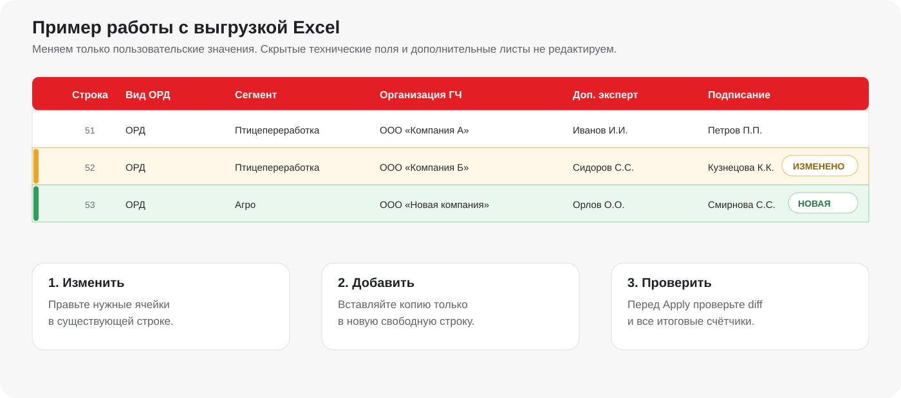
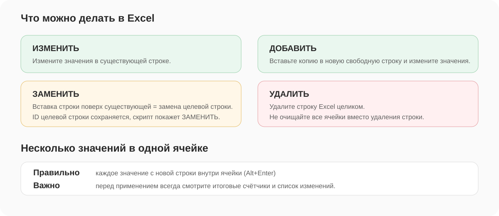
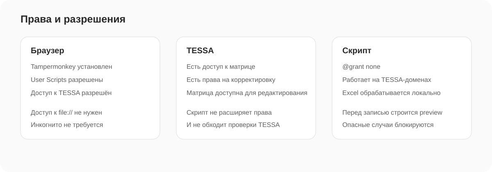

# TESSA Matrix Studio

**Excel-редактор матриц согласования TESSA для Группы Черкизово.**

Редактирование матрицы строится по простой схеме: выгрузить Excel, внести изменения, проверить diff и только после этого применить изменения к TESSA.

<p align="center">
  <a href="https://raw.githubusercontent.com/ShapArt/tessa-matrix-studio/main/tessa-matrix-studio.user.js">
    
  </a>
  <a href="https://github.com/ShapArt/tessa-matrix-studio/archive/refs/heads/main.zip">
    
  </a>
</p>

<p align="center"><b>Версия 1.9.1 · Автор: Шаповалов Артём</b></p>


## Что делает скрипт

TESSA Matrix Studio добавляет в карточку матрицы компактную панель для работы через Excel:

- выгружает текущую матрицу в `.xlsx`;
- сохраняет технические идентификаторы строк для точного сопоставления;
- поддерживает изменение, добавление, замену и удаление строк;
- показывает предварительный список изменений до записи в TESSA;
- проверяет справочники, дубли, права и опасные удаления;
- применяет только корректные строки;
- отображает прогресс длительных операций;
- формирует JSON-отчёт о результате применения.

Скрипт **не расширяет права пользователя и не обходит проверки TESSA**. Для применения изменений нужны штатные права на корректировку матрицы и доступный режим редактирования.

## Как выглядит

<p align="center">
  
</p>

После проверки Excel панель показывает итоговые счётчики и каждое изменение отдельно:

<p align="center">
  
</p>

## Быстрый старт

**Первичная установка выполняется один раз.** Подробная инструкция для Chrome, Firefox, Edge, Opera, Safari и других Chromium-браузеров находится в [docs/INSTALL.md](docs/INSTALL.md).

После установки работа занимает четыре действия:

1. Откройте нужную матрицу TESSA и нажмите **«Скачать Excel»**.
2. Измените лист **«Матрица»** в Excel и сохраните файл.
3. Выберите файл в TESSA и нажмите **«Проверить изменения»**.
4. Проверьте список и нажмите **«Применить к TESSA»**.

Перед первым использованием обязательно прочитайте раздел [Правила работы с Excel](docs/WORKFLOW.md#правила-работы-с-excel).

## Поддерживаемые адреса TESSA

Скрипт запускается только на указанных в metadata адресах:

```text
https://tessa.cherkizovsky.net/*
https://tessa-app01.cherkizovsky.net/*
https://tessa-app01tl.cherkizovsky.net/*
https://tessa-app*.cherkizovsky.net/*
```

## Кнопки панели

| Кнопка | Назначение |
|---|---|
| **Скачать Excel** | Быстрая выгрузка текущей матрицы и уже известных справочников. |
| **Скачать со свежими справочниками** | Принудительно перечитывает справочники TESSA. Используйте после недавнего добавления или переименования значений. |
| **Выбрать Excel** | Выбирает отредактированный `.xlsx`. |
| **Актуализировать выбранный Excel** | Переносит правки в актуальную структуру текущей матрицы, если в TESSA появились новые поля. |
| **Проверить изменения** | Строит diff. В TESSA ничего не записывает. |
| **Применить к TESSA** | Выполняет только проверенный план изменений. |
| **Отмена** | Останавливает длительную операцию, если это возможно на текущем этапе. |

## Основные правила Excel





Критично:

- новая строка добавляется в **новую/свободную строку Excel**;
- вставка копии **поверх существующей строки** считается **заменой целевой строки**;
- для удаления существующую строку Excel нужно удалить целиком;
- полностью очищенная существующая строка не используется как безопасный способ удаления;
- несколько значений в одной ячейке вводятся с новой строки (`Alt+Enter`);
- перед применением нужно проверить счётчики `изменить / добавить / удалить / без изменений / пропустить`.

Полное описание сценариев: [docs/WORKFLOW.md](docs/WORKFLOW.md).

## Права и безопасность



Для работы нужны:

- доступ к нужной матрице TESSA;
- права на её корректировку;
- возможность перевести/открыть матрицу в режиме, в котором TESSA разрешает изменения;
- установленный и включённый Tampermonkey.

Сам userscript использует `@grant none`: он не запрашивает отдельные Tampermonkey API и выполняется в контексте открытой страницы TESSA. Excel читается локально в браузере.

## Документация

- [Установка в Chrome, Firefox, Edge, Opera и Safari](docs/INSTALL.md)
- [Работа со скриптом и Excel](docs/WORKFLOW.md)
- [Ошибки и частые вопросы](docs/TROUBLESHOOTING.md)
- [Устройство кода и сопровождение](docs/DEVELOPMENT.md)
- [История изменений](CHANGELOG.md)
- [Сообщить об ошибке](https://github.com/ShapArt/tessa-matrix-studio/issues/new/choose)

## Обновление

Tampermonkey проверяет `@updateURL` userscript. При публикации новой версии в `main` достаточно увеличить `@version`; пользователи смогут получить обновление штатным механизмом Tampermonkey.

Если автоматическое обновление ограничено политиками браузера, повторно нажмите кнопку **«Установить TESSA Matrix Studio»** в начале этой страницы.

---

**Автор:** Шаповалов Артём  
**Репозиторий:** `ShapArt/tessa-matrix-studio`
