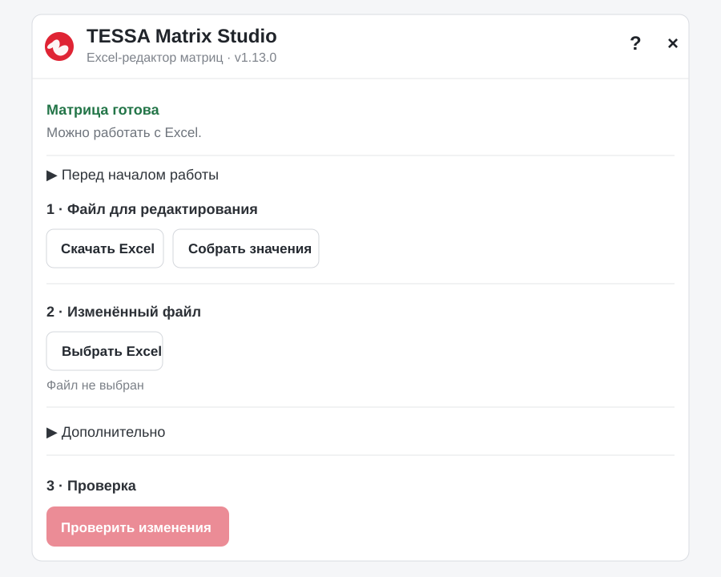
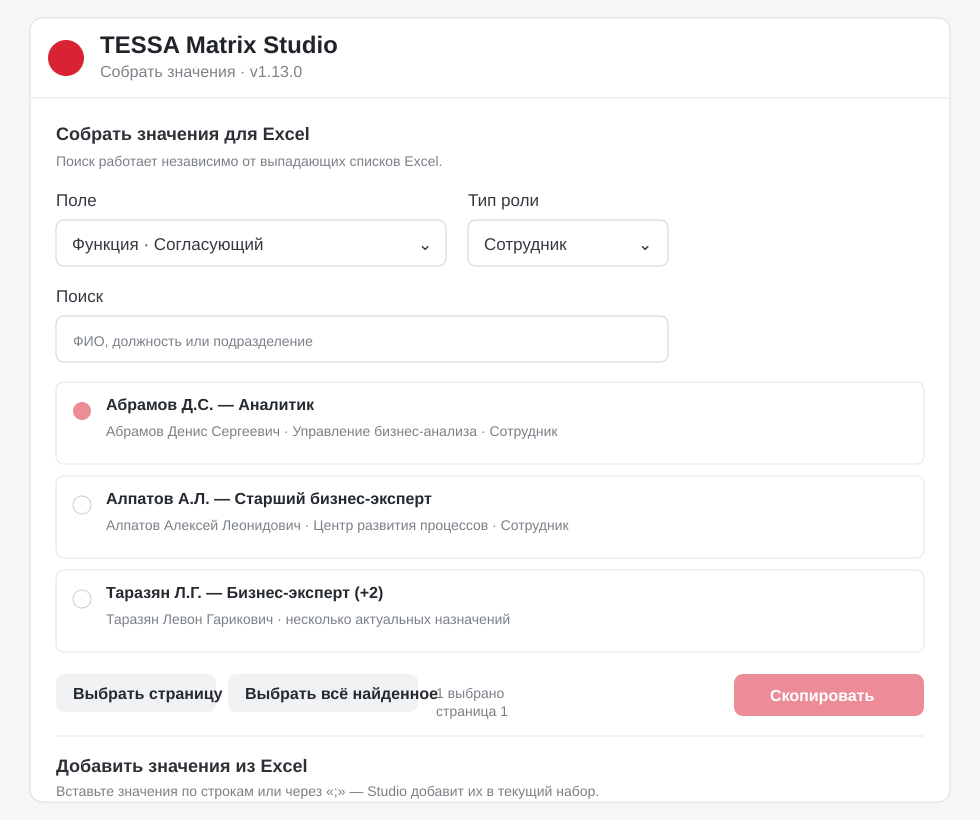
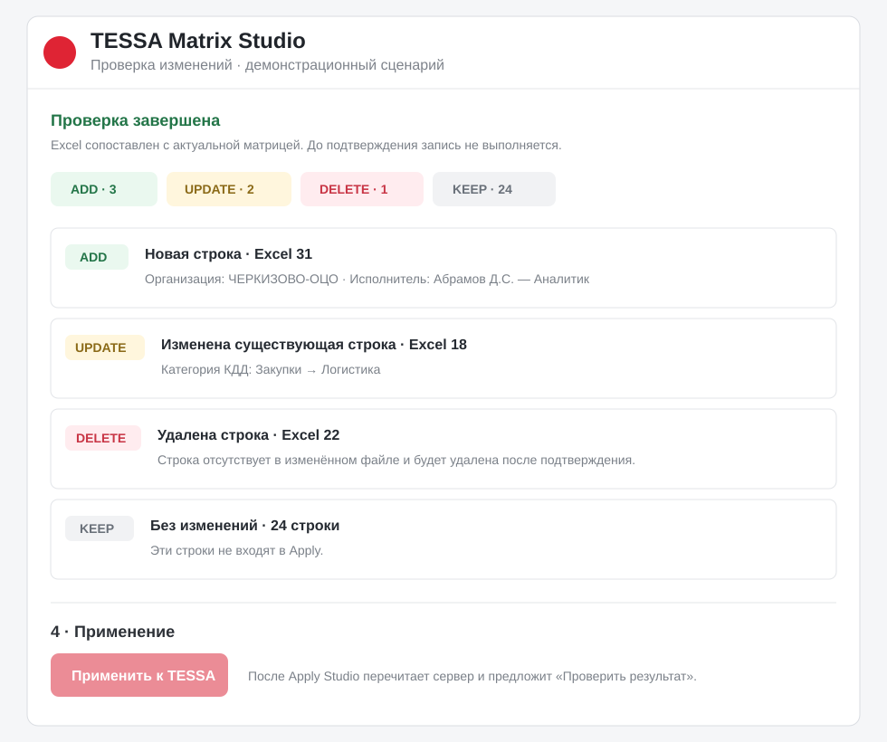
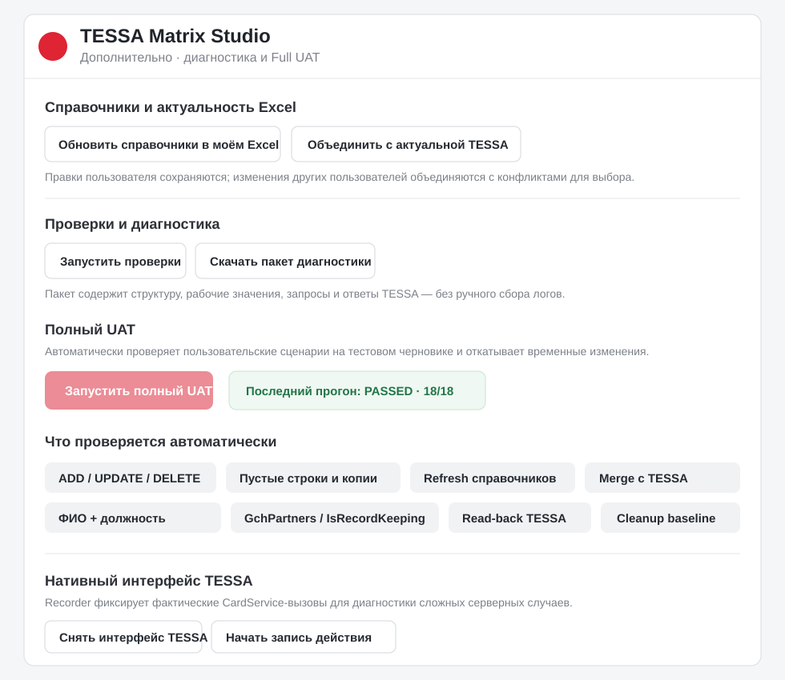

# TESSA Matrix Studio

**Excel-редактор матриц согласования TESSA**

`TESSA → XLSX → массовая правка → Preview → controlled Apply → read-back`

### [УСТАНОВИТЬ](https://github.com/ShapArt/tessa-matrix-studio/releases/latest/download/tessa-matrix-studio.user.js) · [РЕЛИЗ](https://github.com/ShapArt/tessa-matrix-studio/releases/latest) · [CHANGELOG](CHANGELOG.md) · [ISSUES](https://github.com/ShapArt/tessa-matrix-studio/issues/new/choose)

**v1.13.0 · Автор: Шаповалов Артём**

TESSA Matrix Studio добавляет в карточку матрицы отдельную панель для безопасной массовой работы через Excel. Studio не делает «слепой импорт»: сначала читает актуальную матрицу, строит план изменений, показывает ADD / UPDATE / DELETE / KEEP, а запись выполняет только после подтверждения.

> [!IMPORTANT]
> Studio не выдаёт и не повышает права. Для записи нужны штатные права TESSA, редактируемая карточка и состояние матрицы, допускающее изменения.

  
   Актуальная панель v1.13.0.

## Что умеет v1.13.0

- выгружать текущую матрицу в `.xlsx` со служебной identity/baseline-информацией;
- распознавать изменение существующей строки, новую строку и удаление строки;
- корректно обрабатывать копии строк: одна остаётся продолжением исходной записи, остальные могут стать ADD;
- пропускать пустые строки между записями и добавлять заполненные строки ниже диапазона;
- проверять Excel без записи и показывать точный Preview;
- применять выбранный план и затем перечитывать TESSA для независимой проверки результата;
- обновлять справочники в уже изменённом Excel без потери пользовательских правок;
- объединять рабочий Excel с актуальным состоянием TESSA и показывать конфликты;
- искать значения через «Собрать значения», в том числе по ФИО, должности и подразделению;
- показывать сотрудников как **«Фамилия И.О. — должность»**;
- фильтровать актуальные юридические лица `GchPartners` по `IsRecordKeeping=true`, когда поле доступно;
- переносить desired state между двумя матрицами одного `TemplateID` с fail-closed защитой;
- запускать автоматический **Full UAT** на тестовом черновике с cleanup временных изменений;
- собирать диагностический ZIP и записывать фактические native CardService-вызовы для сложных серверных случаев.

---

# Быстрый старт

| Шаг | Что сделать |
|---|---|
| **1** | Откройте нужную матрицу TESSA и убедитесь, что она доступна для редактирования. |
| **2** | Нажмите **Скачать Excel**. Каждый новый экспорт перечитывает актуальные справочники. |
| **3** | Измените файл: правьте значения, добавляйте и удаляйте строки. |
| **4** | В Studio нажмите **Выбрать Excel**, затем **Проверить изменения**. |
| **5** | Проверьте Preview: ADD / UPDATE / DELETE / KEEP и возможные ошибки. |
| **6** | Нажмите **Применить к TESSA** только если план соответствует ожиданиям. |
| **7** | После Apply используйте **Проверить результат**. Studio перечитает сервер и подтвердит фактическое состояние. |

На этапе **«Проверить изменения» ничего в TESSA не записывается**.

## Как редактировать строки в Excel

- **Изменить строку:** измените нужные рабочие ячейки.
- **Удалить строку:** удалите её целиком в Excel или очистите все рабочие значения строки.
- **Удалить отдельное значение:** очистите конкретную ячейку или уберите элемент из набора.
- **Добавить строку:** заполните новую строку. Пустые строки между записями допустимы.
- **Скопировать строку:** можно копировать существующую строку и менять значения — Studio не требует вручную очищать скрытые ID.
- **Ввести значение вручную:** полное точное название принимается сразу; однозначный фрагмент может быть разрешён при проверке, неоднозначный требует уточнения.
- **Формулы в редактируемых рабочих ячейках:** блокируются как небезопасный ввод.

---

# «Собрать значения»

Когда стандартного выпадающего списка Excel недостаточно, используйте **Собрать значения** рядом с кнопкой **Скачать Excel**.

  
   Демонстрационные данные. Для сотрудников основной заголовок — «Фамилия И.О. — должность».

В picker можно:

- выбрать поле и, для функциональных ролей, тип роли;
- искать по имени, ФИО, должности и подразделению;
- выбирать страницу или все найденные значения;
- сохранить выбор между поиском и страницами;
- скопировать итоговый набор для вставки в Excel;
- продолжить набор значениями, вставленными из Excel.

Для нескольких значений в одной ячейке удобнее вставлять их через **F2 → Ctrl+V**. При ручном вводе несколько значений можно разделять переносом строки (`Alt+Enter`).

---

# Preview: что именно будет записано

После **Проверить изменения** Studio строит конкретный план. Preview отделяет новые строки, изменения, удаления и строки без изменений.

  
   Демонстрационный Preview. До Apply запись не выполняется.

Обозначения:

| Статус | Значение |
|---|---|
| **ADD** | новая строка будет создана; |
| **UPDATE** | существующая строка будет изменена; |
| **DELETE** | существующая строка будет удалена; |
| **KEEP** | строка совпадает с TESSA и в Apply не входит; |
| **SKIP / ошибка** | операция не считается безопасно разрешённой и требует внимания. |

Перед записью Studio повторно проверяет актуальное состояние. Если карточка, структура или строки изменились после Preview, небезопасная операция не должна применяться молча.

После Apply успешный ответ сервера ещё не считается окончательным подтверждением: Studio выполняет read-back и сравнивает ожидаемый результат со свежим состоянием TESSA.

---

# Справочники и актуальная TESSA

## Обновить справочники в моём Excel

Выберите изменённый файл в шаге 2 и нажмите **Обновить справочники в моём Excel**. Studio создаст копию книги с текущими справочниками, сохранив пользовательские строки и правки.

Это полезно, если между выгрузкой и загрузкой Excel изменились сотрудники, подразделения, юридические лица или другие справочники.

## Объединить с актуальной TESSA

**Объединить с актуальной TESSA** добавляет изменения, сделанные в матрице после исходной выгрузки. Совместимые изменения объединяются, а настоящие конфликты показываются для выбора.

Для очень старых книг без baseline/identity объединение ограничено — Studio не угадывает происхождение строк.

## Юридические лица

Для `GchPartners` Studio использует актуальный признак `IsRecordKeeping=true`, когда он доступен в этой сборке TESSA. Историческое значение, уже присутствующее в матрице, может сохраняться как snapshot-overlay, но не становится новым разрешённым значением для выбора.

## Старые RoleID

При переносе книги из другой среды или старой матрицы скрытый `RoleID` может уже отсутствовать в текущем `MtxRoles`. В этом случае Studio останавливает такую строку **до Store** и предлагает выбрать актуального исполнителя вместо автоматической подмены по похожему ФИО.

---

# Дополнительно: диагностика и Full UAT

  
   Full UAT предназначен для тестового черновика и автоматически очищает временные тестовые изменения.

В разделе **Дополнительно** доступны:

- **Запустить проверки** — read-only проверка матрицы, Excel и справочников;
- **Скачать пакет диагностики** — ZIP с данными проверки, структурой и техническими ответами TESSA;
- **Full UAT** — воспроизводимый автоматический прогон пользовательских сценариев;
- **Снять интерфейс TESSA / запись нативного действия** — диагностический recorder фактических вызовов CardService.

Full UAT проверяет, среди прочего:

- ADD / UPDATE / DELETE;
- физическое удаление строки и полную очистку строки;
- новые записи после пустых строк;
- копии строк со скрытой identity;
- неправильное значение справочника;
- refresh справочников без потери строк;
- merge с актуальной TESSA;
- связь колонок со справочниками;
- `GchPartners / IsRecordKeeping`;
- отображение `Фамилия И.О. — должность`;
- Store → read-back;
- обязательный cleanup тестовых строк и восстановление baseline.

> [!WARNING]
> Full UAT запускайте только на отдельном тестовом черновике. Runner удаляет свои временные строки и проверяет восстановление baseline, но это всё равно реальная write-проверка TESSA.

Подробнее: [Studio Diagnostics](docs/STUDIO-DIAGNOSTICS.md), [Test Strategy](docs/TEST-STRATEGY.md) и production runbook: [docs/PRODUCTION-RUNBOOK.md](docs/PRODUCTION-RUNBOOK.md).

---

# Перенос между матрицами

Если Excel выгружен из **другой карточки с тем же `TemplateID`**, Studio может трактовать книгу как желаемое итоговое состояние целевой матрицы:

- исходные RowID/VersionID не используются как identity целевой карточки;
- совпавшие строки становятся KEEP;
- отсутствующие в целевой матрице строки становятся ADD;
- лишние target-строки становятся DELETE;
- все ADD проходят preflight до первой записи;
- если часть desired state невозможно безопасно разрешить, весь destructive replacement блокируется до Store/Delete.

Файл другого `TemplateID`, книга без надёжной identity или неоднозначное состояние блокируются fail-closed.

---

# Установка

Нужно установить Tampermonkey, разрешить выполнение userscript'ов и затем установить Studio.

## 1. Установите Tampermonkey

| Браузер | Установка Tampermonkey | Настройки расширений |
|---|---|---|
| **Google Chrome** | [Chrome Web Store](https://chromewebstore.google.com/detail/tampermonkey/dhdgffkkebhmkfjojejmpbldmpobfkfo) | `chrome://extensions` |
| **Microsoft Edge** | [Microsoft Edge Add-ons](https://microsoftedge.microsoft.com/addons/detail/tampermonkey/iikmkjmpaadaobahmlepeloendndfphd) | `edge://extensions` |
| **Яндекс.Браузер** | Установите Tampermonkey из [Chrome Web Store](https://chromewebstore.google.com/detail/tampermonkey/dhdgffkkebhmkfjojejmpbldmpobfkfo). Яндекс.Браузер поддерживает расширения из каталога Chrome. | `browser://extensions` |

Официальные инструкции: [Tampermonkey — разрешение на userscript'ы](https://www.tampermonkey.net/faq.php?q=Q209), [Яндекс.Браузер — расширения](https://browser.yandex.com/help/ru/personalization/extension).

### Если Tampermonkey установлен, но Studio не запускается

Для Tampermonkey **5.3+** в Chromium-браузерах требуется дополнительное разрешение на `userScripts`:

- в Chrome 138+ откройте управление Tampermonkey и включите **Allow User Scripts / Разрешить userscript'ы**;
- либо включите **Режим разработчика** на странице расширений браузера;
- в Яндекс.Браузере при необходимости откройте `browser://extensions` и включите режим разработчика.

Если браузер управляется корпоративными политиками, установка или запуск внешних расширений может быть ограничен администратором.

## 2. Установите TESSA Matrix Studio

Нажмите:

### **[УСТАНОВИТЬ TESSA MATRIX STUDIO v1.13.0](https://github.com/ShapArt/tessa-matrix-studio/releases/latest/download/tessa-matrix-studio.user.js)**

Tampermonkey откроет окно установки userscript. Подтвердите установку версии **1.13.0**, затем обновите страницу TESSA (`Ctrl+R`).

Текущая версия: **1.13.0**.

Studio настроена на корпоративные адреса TESSA из userscript (`tessa-app*`, `tessa-app01`, `tessa-app01tl`, `tessa.cherkizovsky.net`).

---

# Если что-то не работает

**Ссылка .user.js открылась как текст или установка не стартовала**

Если браузер показывает исходный код вместо окна Tampermonkey, сначала убедитесь, что Tampermonkey установлен и включён, затем повторно откройте ссылку установки. В Chromium-браузерах также проверьте разрешение userscript'ов / режим разработчика.

Если прямая ссылка всё равно открывается как текст, используйте ручной импорт: откройте **Tampermonkey → Dashboard / Панель управления**, затем **Utilities / Сервис**. В разделе **URL** вставьте:

`https://github.com/ShapArt/tessa-matrix-studio/releases/latest/download/tessa-matrix-studio.user.js`

Проверка обновлений выполняется через отдельный metadata URL:

`https://github.com/ShapArt/tessa-matrix-studio/releases/latest/download/tessa-matrix-studio.meta.js`

**Панель Studio не появилась**

1. Проверьте, что Tampermonkey включён.
2. Проверьте разрешение `Allow User Scripts` / режим разработчика.
3. Проверьте, что userscript TESSA Matrix Studio включён в Tampermonkey.
4. Обновите страницу TESSA.

**«Проверить изменения» недоступна**

Сначала выберите изменённый Excel. Studio также должна успешно подключиться к открытой матрице.

**Studio показывает SKIP или ошибку справочника**

Не обходите её ручным Apply. Сначала обновите справочники в Excel или выберите актуальное значение через «Собрать значения».

**Нужен технический разбор**

Откройте **Дополнительно → Скачать пакет диагностики**. Для проблем, зависящих от нативного интерфейса TESSA, используйте recorder только на коротком воспроизводимом действии.

---

# Права и безопасность

Studio придерживается fail-closed поведения:

- Preview сам ничего не записывает;
- формулы и неоднозначная identity не превращаются в догадки;
- перед Apply выполняется повторная проверка актуальности;
- ADD проверяются до Store;
- cross-matrix replacement не выполняет DELETE, если desired state разрешён не полностью;
- после записи выполняется read-back;
- несохранённые изменения карточки и конфликтующие состояния блокируют опасные операции;
- Studio не повышает права пользователя и не обходит серверную валидацию TESSA.

---

# Документация проекта

| Что нужно | Документ |
|---|---|
| Последние изменения | [CHANGELOG.md](CHANGELOG.md) |
| Архитектура | [docs/ARCHITECTURE.md](docs/ARCHITECTURE.md) |
| Карта кода | [docs/CODE-MAP.md](docs/CODE-MAP.md) |
| Диагностика Studio | [docs/STUDIO-DIAGNOSTICS.md](docs/STUDIO-DIAGNOSTICS.md) |
| Production runbook | [docs/PRODUCTION-RUNBOOK.md](docs/PRODUCTION-RUNBOOK.md) |
| Стратегия тестирования | [docs/TEST-STRATEGY.md](docs/TEST-STRATEGY.md) |
| История синхронизации строк | [docs/EXCEL-ROW-SYNC-1.12.0.md](docs/EXCEL-ROW-SYNC-1.12.0.md) |

---

**TESSA Matrix Studio v1.13.0**

[Release](https://github.com/ShapArt/tessa-matrix-studio/releases/tag/v1.13.0) · [Install userscript](https://github.com/ShapArt/tessa-matrix-studio/releases/latest/download/tessa-matrix-studio.user.js) · [Report an issue](https://github.com/ShapArt/tessa-matrix-studio/issues/new/choose)

