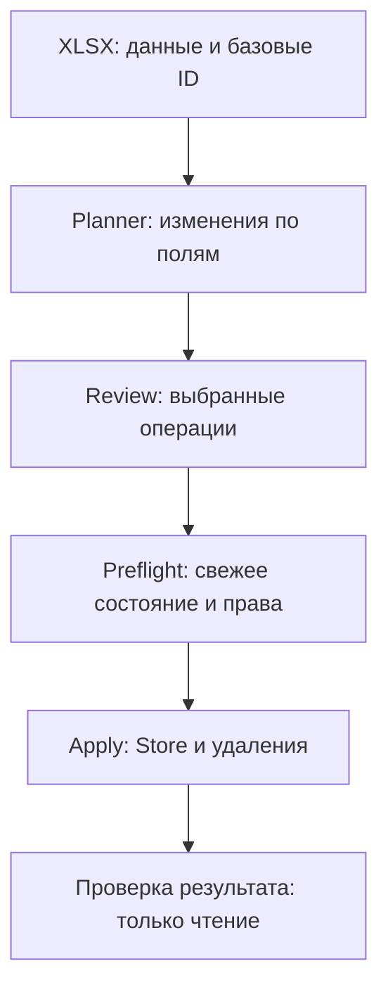

# Карта кода

Рабочий файл — [`tessa-matrix-studio.user.js`](../tessa-matrix-studio.user.js). Он устанавливается без сборщика и внешних JavaScript-зависимостей. Номера секций в комментариях помогают найти нужную часть; имена функций можно искать через `rg` или поиск редактора.

## Поток данных

UI-фильтр и поиск меняют видимый список. Исключение строки или поля меняет состав применения. Эти два вида действий разделены: скрытая поиском операция не становится автоматически исключённой.

## Где что находится

| Секция | Основные точки входа | Ответственность |
|---|---|---|
| 1. Состояние | `APP`, `ROUNDTRIP`, `S`, `F`, `OPERAND` | Состояние вкладки, имена секций/полей TESSA, формат XLSX, лимиты |
| 2. Утилиты | `parseRange`, `typedScalarSemantic`, `reconciliationSemanticKey`, `splitCell` | Типы, нормализация, семантическое сравнение, безопасное представление |
| 3. Чтение XLSX | `readXlsxArrayBuffer`, `parseSheetXml` | ZIP/XML/OPC, выбор рабочего листа, типы ячеек, baseline |
| 4. Запись ZIP | ZIP/XML writer helpers | Формирование контейнера без макросов |
| 5. Справочники | `dictionaryLookup`, `resolveEmbeddedDictionaryValue`, `dictionaryCacheKey` | Поиск по точным ID/подписям, неоднозначности, кэш по структуре |
| 6. Выгрузка | `buildRoundtripGrid`, `createRoundtripXlsxBytes` | Рабочие поля, скрытые ID, словари, инструкции и текстовый формат |
| 7. Bridge | `TessaBridge.create`, `requestStructure`, `loadSnapshot`, `rebuildRowCard` | Единственная связь с объектами TESSA и штатными CardService API |
| 8. Сопоставление | `buildColumnMap`, `workbookRowsToDesired` | Schema ID → поле шаблона, проверка содержимого ячейки |
| 9. Planner/review | `buildPlan`, `buildReviewedPlan`, `keepReviewedPackage` | UPDATE/ADD/DELETE/NOOP/SKIP, дубли, исключение отдельных полей |
| 10. Безопасность | `evaluatePlanSafety`, `deletionGuard`, `reconcileMutationReceipts` | Контекст, ограничения удаления, подтверждение записанного состояния |
| 11. Операции | `analyzeSelectedFile`, `preflightPlan`, `applyPlan`, `exportCurrentMatrixXlsx` | Чтение, свежие проверки, подтверждение, запись и отчёт |
| 12. Интерфейс | `mountUi`, `renderPlan`, `previewValuesHtml`, `setBusy`, `createRuntimeMonitor`, `openValuePicker` | Последовательные действия, краткие статусы, поиск, выбор и блокировки |

Комментарии рядом с записью объясняют порядок действий и причины запретов. При изменении поведения обновляйте комментарий, соответствующий тест и UAT.

## Границы записи

`buildPlan`, `buildReviewedPlan`, parser, picker и runtime monitor не сохраняют карточки. Monitor проверяет только локальные объекты загруженной страницы. Он работает при открытой панели и видимой вкладке, не пересобирает план и не сканирует snapshot на каждом такте.

`preflightPlan` перечитывает данные, проверяет карточку и TemplateID, версии строк, права, типы и зависимости. Preview может обращаться к серверной проверке дубликатов/создания карточки, но не выполняет Store/Delete.

`applyPlan` выполняет подтверждённые операции. После первой записи старый план погашается. Состояние после Store сверяется отдельной операцией `runReconciliationRead`: она не делает rollback или повторную запись.

## Инварианты изменения полей

- Приоритет сопоставления — stable schema ID и ID строки. Подпись и позиция не заменяют identity-проверку.
- Пустое значение, ноль и `false` различаются.
- Диапазон хранит обе границы. Нельзя использовать `parseInt` для «починки» дроби, даты или текста с хвостом.
- В точно сопоставленном UPDATE можно сохранить ошибочное поле и применить другие. Весь неверный multivalue сохраняется целиком: частично распознанный список не обрезается.
- Новая строка, замена и повреждённые служебные поля не получают такое частичное исправление.
- Дубли сравниваются по ID, RoleTypeID и типам. Совпадение отображаемых имён само по себе не делает строки дублями.
- Переключение матрицы или шаблона очищает состояние только после окончания текущей операции; preflight проверяет актуальный контекст независимо от UI.

## Где проверять изменение

| Область | Основные тесты |
|---|---|
| Автоподключение, busy, смена карточки/шаблона | `runtime-capability-probe.mjs`, `runtime-monitor-integration.mjs` |
| Picker и поиск 25 000 значений | `studio-ux.mjs`, `dictionary-high-cardinality.mjs` |
| Разные шаблоны и все восемь типов | `multi-template-roundtrip.mjs`, `xlsx-auto-date.mjs`, `xlsx-coercion.mjs` |
| Частичное сохранение поля и диапазоны | `field-update-regressions.mjs` |
| Review, исключения, большие пакеты | `review-*.mjs`, `apply-batch-limit.mjs`, `apply-preview-batch-ux.mjs` |
| Гонки Store/ADD/DELETE, stale | `apply-*-race.mjs`, `preflight-stale-*.mjs`, `baseline-integrity.mjs` |
| Отмена, результат, refresh | `apply-cancel-result.mjs`, `apply-source-skips-success.mjs`, `post-apply-view-refresh.mjs` |
| Проверка результата и конфликты identity | `reconciliation*.mjs`, `mutation-receipts.mjs` |
| ZIP/XML/OPC, Office-совместимость | `xlsx-archive-security.mjs`, `xlsx-spreadsheetml-security.mjs`, `xlsx-opc-relationships.mjs`, `xlsx-office-interop.mjs` |
| Нагрузка и неизменённый roundtrip | `mega-mixed-load.mjs`, `xlsx-load.mjs`, `xlsx-high-cardinality.mjs` |

Запуск из корня: `npm test` (Node.js 22+; точная версия CI указана в workflow). Все тесты входят в один сценарий. Они используют синтетические данные и не обращаются к корпоративной TESSA. Пользовательские выгрузки, ФИО и сохранённые страницы в репозиторий не добавляются.

## Добавление нового типа поля

Сначала подтвердите тип по структуре TESSA и штатному представлению. Затем согласованно измените `operandKind` → чтение/валидацию → `rebuildRowCard` → семантическое сравнение → выгрузку. Добавьте clean roundtrip, UPDATE, очистку, invalid input и результат после Apply. Неизвестный тип нельзя трактовать как строку ради зелёного Preview.

## Документы

[Архитектура](ARCHITECTURE.md) описывает API и identity. [Runbook](PRODUCTION-RUNBOOK.md) — эксплуатацию, ошибки и выпуск. [UAT 1.9.42](UAT-v1.9.42-STUDIO-UX.md) — пользовательские проверки и границы автоматического подтверждения.

## Ввод и представление (1.9.43)

`createRoundtripXlsxBytes` сохраняет data validation и отключает только input message. `instructionSheetXml` содержит правила нескольких значений и диапазонов. `workbookRowsToDesired` сначала проверяет тип ячейки: отклонённые формулы не проходят дорогостоящий поиск словаря. Ошибка словаря не повторяется в типовой проверке.

`previewValuesHtml` меняет только представление: тип Boolean берётся из шаблона, значения экранируются по отдельности; исходные ID, порядок и план не меняются. Шрифт задаётся через `--font-default` с локальным Gotham Pro Server / Segoe UI в резерве. CSS-анимации относятся к открытию и взаимодействию, отключаются через `prefers-reduced-motion`, не используют таймеры или сеть.

В 1.9.44 кнопка `#tms-open-picker` и раскрываемый блок `#tms-value-picker` находятся в первом шаге, рядом со скачиванием Excel. `openValuePicker`/`closeValuePicker` синхронизируют `aria-expanded`. Положение блока не меняет загрузку словаря, состав Apply или работу с буфером обмена.

В 1.9.45 `setControlDisabled` обновляет семантическое состояние кнопок, которое `setBusy(false)` восстановит после завершения операции. Он нужен, когда доступность меняется во время блокировки: `rememberReport`, `renderPlanConsumedNotice` и успешное ручное обновление. Пока `APP.busy` установлен, кнопка остаётся заблокирована. Это сохраняет защиту от повторного действия и не оставляет готовый отчёт недоступным из-за старого значения `disabled`. Регрессия: `tests/apply-report-opt-in.mjs`; исходные ограничения пустого picker/пагинации: `tests/runtime-monitor-integration.mjs`.

В 1.9.46 `#tms-download-report` перенесена в `.tms-tools`. Обработчик и `rememberReport` прежние; открытие раздела не запускает скачивание.

## Отказы проверки дубликатов (1.9.47)

`TessaBridge.validateDuplicate` принимает только `ok === true`. `DuplicateValidationError` отмечает подтверждённый отказ этого этапа; `runtimeSkip` переносит в отчёт фиксированные диагностические поля. `rowFailuresHtml` выводит операционные отказы независимо от длинного списка ошибок Excel и вызывается из Preview и `renderPlanConsumedNotice`. Сетевую ошибку Store нельзя помечать как «запись не запускалась».

Регрессии: `tests/duplicate-validation-contract.mjs`, `tests/apply-add-race.mjs`. Контракт запроса, известный серверный дефект и воспроизведение: [диагностика](DUPLICATE-CHECK-DIAGNOSTICS.md).

## Полностью отклонённый Preview (1.9.48)

`selectPreviewItems` включает в «Все» сначала операции, затем пропуски. Поиск выполняется до пагинации по обоим видам. NOOP не выводятся в список. `keepReviewedPackage` продолжает работать только с исходными операциями, поэтому расширение видимого списка не может превратить отказ в разрешённую запись.

`renderPlan` считает доступные операции через `applyAvailability`, скрывает выбор пакета при отсутствии исходных изменений, но сохраняет возврат ручных исключений. Короткий список из одних пропусков раскрывается сразу. `rowFailureReason` отвечает только за краткий текст; исходная причина остаётся в закрытых подробностях и отчёте. Тест: `tests/preview-only-skips.mjs`.
