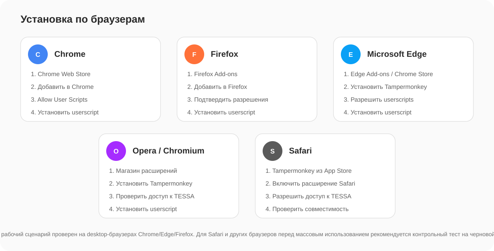

# Установка TESSA Matrix Studio

Установка состоит из двух частей: сначала устанавливается Tampermonkey, затем сам userscript.

## 1. Установить Tampermonkey

Используйте только официальные страницы расширения:

- Chrome Web Store: https://chromewebstore.google.com/detail/tampermonkey/dhdgffkkebhmkfjojejmpbldmpobfkfo
- Firefox Add-ons: https://addons.mozilla.org/firefox/addon/tampermonkey/
- Официальный сайт: https://www.tampermonkey.net/

### Google Chrome

1. Откройте страницу Tampermonkey в Chrome Web Store.
2. Нажмите **«Добавить в Chrome»**.
3. Проверьте запрашиваемые разрешения и подтвердите **«Установить расширение»**.
4. Закрепите Tampermonkey на панели браузера, чтобы его значок был виден.

В актуальных Chrome Tampermonkey требует дополнительного разрешения на выполнение userscripts. Официальная документация Tampermonkey указывает два варианта: переключатель **Allow User Scripts** в настройках расширения (Chrome 138+) или Developer Mode для браузеров/версий, где этого переключателя нет.

Открытие настроек расширения:

Включите **Allow User Scripts**:

Если такого переключателя нет, откройте `chrome://extensions` и включите режим разработчика по инструкции Tampermonkey:

Официальная справка: https://www.tampermonkey.net/faq.php?q=Q209

### Mozilla Firefox

1. Откройте страницу Tampermonkey на Firefox Add-ons.
2. Нажмите **«Добавить в Firefox»**.
3. Просмотрите список разрешений и подтвердите установку.
4. При желании закрепите значок Tampermonkey на панели Firefox.

Firefox на странице дополнения показывает разрешения Tampermonkey до установки. Это разрешения самого менеджера userscripts; TESSA Matrix Studio дополнительно не запрашивает Tampermonkey API (`@grant none`).

Страница расширения: https://addons.mozilla.org/firefox/addon/tampermonkey/

Справка Mozilla по установке дополнений: https://support.mozilla.org/kb/find-and-install-add-ons-add-features-to-firefox

### Microsoft Edge

Edge поддерживает расширения Chromium. Можно установить Tampermonkey из магазина Edge или из Chrome Web Store.

Если используется Chrome Web Store, Edge может сначала попросить включить **«Разрешить расширения из других магазинов»**. После этого установка выполняется обычной кнопкой добавления расширения.

Официальная справка Microsoft: https://support.microsoft.com/edge/add-turn-off-or-remove-extensions-in-microsoft-edge

### Opera

Tampermonkey выпускает отдельную официальную версию для Opera и также поддерживает Chromium-сборку через Chrome Web Store. После установки проверьте, что расширение включено и имеет доступ к домену TESSA.

Официальный список поддерживаемых версий: https://www.tampermonkey.net/faq.php?q=Q406

### Safari

Tampermonkey официально доступен для Safari на macOS и iOS через App Store. Для TESSA Matrix Studio основной рабочий сценарий ориентирован на desktop TESSA; перед использованием Safari выполните контрольный тест на черновой матрице и убедитесь, что браузер разрешает расширению доступ к сайту TESSA.

Официальный список версий Tampermonkey: https://www.tampermonkey.net/faq.php?q=Q406

### Brave и другие Chromium-браузеры

Используйте версию Tampermonkey для Chromium. Порядок обычно совпадает с Chrome: установить расширение, разрешить userscripts и убедиться, что Tampermonkey имеет доступ к странице TESSA.

Если браузер управляется организацией и установка расширений запрещена политикой, самостоятельно обойти это ограничение нельзя — потребуется разрешение администратора браузера.

## Как выглядит Tampermonkey

После установки значок Tampermonkey находится рядом с адресной строкой либо в меню расширений. Через него можно увидеть активные userscripts, открыть Dashboard и временно выключить скрипт.

Официальный скриншот встроенного редактора Tampermonkey (Firefox Add-ons):

Для обычной работы с TESSA Matrix Studio **редактировать код в Dashboard не нужно**. Пользователю достаточно, чтобы скрипт был установлен и включён.

## 2. Разрешения Tampermonkey

Для TESSA Matrix Studio нужны следующие условия:

| Настройка | Что выбрать |
|---|---|
| Tampermonkey | Включён |
| Allow User Scripts / User Scripts | Включено, если браузер показывает этот переключатель |
| Доступ к сайту | Разрешён для доменов TESSA |
| Доступ к `file://` | **Не нужен** |
| Работа в приватном/инкогнито режиме | **Не нужна** |

Tampermonkey предупреждает, что слишком ограниченный Site Access может нарушать отдельные функции расширения, включая обновление userscripts. Если скрипт работает на TESSA, но не обновляется автоматически, проверьте Site Access в настройках Tampermonkey. Официальное пояснение: https://www.tampermonkey.net/faq.php?q=Q306

## 3. Установить TESSA Matrix Studio

Нажмите:

[**Установить TESSA Matrix Studio**](https://raw.githubusercontent.com/ShapArt/tessa-matrix-studio/main/tessa-matrix-studio.user.js)

Tampermonkey откроет страницу установки userscript.

Проверьте перед установкой:

- название: **TESSA Matrix Studio — Черкизово**;
- автор: **Шаповалов Артём**;
- адреса запуска содержат только домены TESSA;
- `@grant none`;
- версия совпадает с опубликованной в репозитории.

Нажмите **Install / Установить**.

## 4. Проверить установку

1. Откройте TESSA.
2. Перейдите в карточку матрицы.
3. Обновите страницу (`Ctrl+R`).
4. В правом нижнем углу должна появиться круглая красная кнопка TESSA Matrix Studio.
5. Нажмите её — откроется панель.

Если кнопки нет, перейдите в [TROUBLESHOOTING.md](TROUBLESHOOTING.md#скрипт-установлен-но-кнопки-в-tessa-нет).

## 5. Права в TESSA

Установка скрипта не выдаёт прав в TESSA.

Для **просмотра/выгрузки** нужен доступ к карточке матрицы. Для **применения изменений** пользователь должен иметь штатные права на корректировку соответствующей матрицы и работать в состоянии/режиме, где TESSA разрешает редактирование.

Если кнопка применения заблокирована из-за прав или состояния матрицы, это нормальная защита — скрипт не должен обходить ограничения TESSA.
